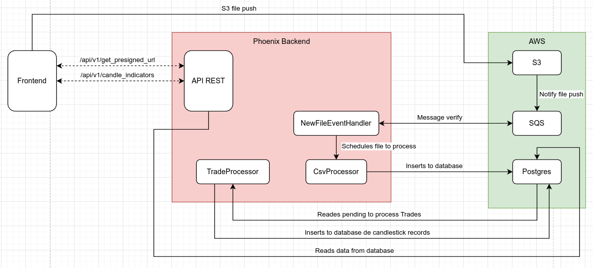

## CatalyxTest

## Structure

This application uses a event driven architecture, using `AWS SQS` as Queue Broker and `AWS S3` as File server

The configuration adds the action to S3 to notify when some file it's pushed to a specific repo, this notification it's
inserted to SQS with all the details and a worker verifies the message and enqueues to another worker that will insert all
data to database and then another worker will check the pending records to evaluate and creates the candle stats

All the calls to all endpoints are just a read from database, all calculations and data insertions are from workers



> The periods are of **24 hours** so will create the candles using the whole day transactions
> Frontend it's the client, right now it's postman

## How to run it

#### Pre-requisites

The application runs using Docker for containers and Maketool to create shortcuts, Docker it's for ensure the right 
version in all the local environments

- Docker with Compose
- Maketool (available by default on MacOSX and Linux systems)

**IMPORTANT!** You need insert this to your `/etc/hosts` to ensure LocalStack will work correctly

```
127.0.0.1       localstack
```

#### Commands

- `make` to compile and create docker images
- `make up` to start the server (`make` must be executed first)
- When server is running
    - `make testing` to run tests
    - `make iex` to run interactive console with the project modules available
    - `make bash` starts a bash session inside the app container
    - `make routes` get the available rotues of Phoenix
    - `make rollback` rollbacks the database last migration
    - `make migrate` runs the pending migration
    - `make format` runs the formatter modifying the files to solve code style warns

Now you can visit [`localhost:4000`](http://localhost:4000) from your browser.

## How to push file

First call to the endpoint `POST "/api/v1/get_presigned_url"` and get the url

This new url must be called using PUT using the entire file as body

#### Examples

```elixir
url = "http://localstack:4566/files/the_file_name.csv?query=params"
%{status_code: code} = HTTPoison.put!(url, {:file, "/example/path"})
```

```shell script
# using curl
curl --location --request PUT 'http://localstack:4566/files/the_file_name.csv?query=params' \
--data-binary '/home/user_default/route/to/file.csv'
```

## Endpoints

- Insert manually records to process
    - `POST "/api/v1/trades"`
    - ```json
      {
        "data": [
          {
            "market_symbol": "USD/MXN",
            "amount": 1000,
            "price": 17120,
            "transaction_type": "buy",
            "executed_at": "2023-08-07 17:38:00Z",
            "external_id": "some external_id"      // optional
          }
        ]
      }
      ```
- Get S3 url to push file
    - `POST "/api/v1/get_presigned_url"`
- Last n trades in a market
    - `GET "/api/v1/trades?size=30&market=BTC"`
- Last n trades overall
    - `GET "/api/v1/trades?size=30"`
- Trades in a market for a given time window
    - `GET "/api/v1/trades?start=2023-08-05&end=2023-08-11"`
- Last n candles in a market for a given period
    - `GET "/api/v1/candle_indicators?market=BTC&size=30&start=2023-06-09&end=2023-08-09"`
- Last n candles overall for a given period
    - `GET "/api/v1/candle_indicators?size=30&start=2023-06-09&end=2023-08-09"`
- All candles in a given time window and period
    - `GET "/api/v1/candle_indicators?&start=2023-06-09&end=2023-08-09"`
- SMA of a market for a given point in time
    - `GET "/api/v1/candle_indicators/BTC/sma_show?date=2023-08-09"`
- SMA of a market.
    - `GET "/api/v1/candle_indicators/BTC/sma"`
    - by default returns last 6 months

## References

- [Processing Large CSV files with Elixir Streams](https://www.poeticoding.com/processing-large-csv-files-with-elixir-streams/)
- [Event Based System with Localstack (Elixir Edition): Uploading files to S3 with PresignedURL's](https://dev.to/nicolkill/event-based-system-with-localstack-elixir-edition-uploading-files-to-s3-with-presignedurls-5ha4)
